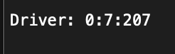
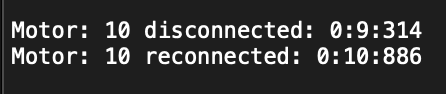
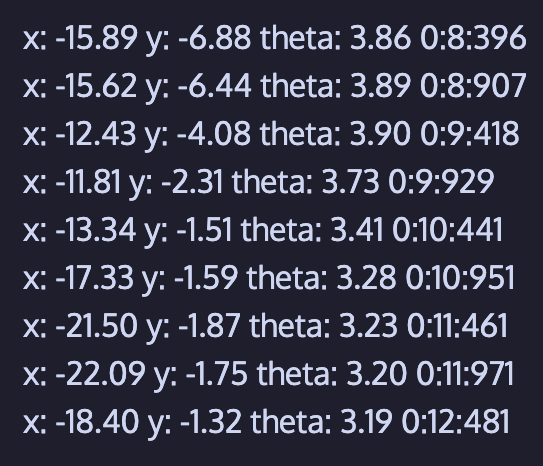

# maelstrom
<p align="center">
   
</p>


## Table of Contents
1. [Intro](#Intro)
2. [Installation](#Installing-maelstrom-library)
3. [Alternative Installation](#Alternative-instructions-for-installing-maelstrom-library)
4. [Set-up](#Set-up)
5. [Alternative set-up](#Alternative-set-up)
6. [Using maelstrom (core functions)](#Using-maelstrom-core-functions)
7. [Extra functions](#Extra-functions)
8. [Output and functionality of maelstrom functions](#Output-and-functionality-of-maelstrom-functions)
10. [Function compatibility notes](#Function-compatibility-notes)
11. [License](#License)
12. [Contact](#Contact)

## Intro
maelstrom is a library for [PROS](https://pros.cs.purdue.edu/). Made to access data and information in cases where the robot can't be connected to a computer and so that data can be accessed at a later time, even when the program is terminated. Developed by Gaston from V5RC Team 6104G Tempest

## Installing maelstrom library
1. In the integrated PROS terminal, run the command `pros c add-depot maelstrom https://lunar-eclipse255.github.io/maelstrom/template.json`

2.  `cd` into your pros project

3.  Make sure you are in the kernel version 4.1.0, your version can be found out with `pros c info-project` 

4. Apply the library to the project with `pros c apply maelstrom`

5. Put `#include "maelstrom/api.hpp"` in your main.h


## Alternative instructions for installing maelstrom library


1.  To get the library/template, head over to the releases page and download maelstrom@<version>.zip

2. Move the zip file to the pros project

3.  Make sure you are in the kernel version 4.1.0, your version can be found out with `pros c info-project` 

4. Run `pros c fetch maelstrom@<version>.zip` in order to import the template

5. Apply the library to the project with `pros c apply maelstrom`

6. Put `#include "maelstrom/api.hpp"` in your main.h


## Set-up

1. From this Github repository download the folder called logs

2. Put that folder in the root of the SD Card


## Alternative set-up

1. In the root of the SD Card make a folder called logs

2. In the folder logs make a file called run_nums.txt

3. On the first line of run_nums.txt write R0


## Using maelstrom (core functions)
1. In `initialize()` in main.cpp call `init()`:
   ```cpp
      init(bool run_error_log, bool run_data_log, std::vector<int> left_motor_ports, std::vector<int> right_motor_ports, int battery_threshold);
   ```
    * 'bool run_error_log' is used if you want to create a file to log errors
    * 'bool run_data_log' is used if you want to create a file to log data such as coordinates
    * `std::vector<int> left_motor_ports``` is for inputting the ports of your left motors in the form of a std::vector
    * `std::vector<int> right_motor_ports`` is for inputting the ports of your right motors in the form of a std::vector
    * `int battery_threshold` is for inputting at what battery level do you want to be warned about
    * Here is an example:
       ```cpp
        std::vector<int> left_motors = {1, -2, 3};
        std::vector<int> right_motors = {-4, 5, -6};
        maelstrom::logging::init(true, true, left_motors, right_motors, 50);
        ```

  
2. In `initialize()` use this code to run the error logger in background of autonomous and driver control.
   ```cpp
      pros::Task error_logger(maelstrom::logging::robot_faults_log);
   ```


3. In `opcontrol()` and before the `while (true)` loop put this line of code that in the background writes to the data log file the current coordinates of the robot:
   ```cpp
      pros::Task coords_logging(maelstrom::logging::robot_coords_log);
   ```


4. In `opcontrol()` but inside the `while (true)` loop call this function that updates the coordinates that `maelstrom::logging::robot_coords_log()` uses
   ```cpp
      void set_robot_coords(double x, double y, double theta);
   ```
   * Change double x, double y, and double theta, for variables of the double type that hold those respective coordinates. For example:
     ```cpp
        maelstrom::logging::set_robot_coords(x_pos, y_pos, theta_heading);
     ```

## Extra functions
1. In any function you can use `maelstrom::logging::write_to_file(std::string message, log_file file);` this function can be used to write a message to either the log or error file
   * The std::string will be the message and the log_file will be used to specify which file to write to, use `E_ERROR_LOG` to write to the error log file and `E_DATA_LOG` to write to the data log file.
   * This example will write the message Good Luck to the data log file:
       ```cpp
          maelstrom::logging::write_to_file("Good Luck", maelstrom::logging::E_DATA_LOG);
       ```
2. In any function you can use `task_complete(std::string task_name, bool completion);` to write to the error log file if a task was completed or not
   * It takes an std::string for the task name and a boolean to see if a task was completed or not
   * ex.)
       ```cpp
          maelstrom::logging::task_complete("Auton", auton_complete);
       ```
       would write `Auton Complete` to the error log file if auton_complete was true, and `Auton Incomplete` if auton_complete was false
3. In any function `battery(int battery_threshold);` can be used to see if the battery percentage is lower than an int threshold. This funtion is used in `robot_faults_log()` to logto the error log file if the battery is too low but can also be used seperately
   * In the example below it will return true if the battery percentage is above 50% and returns false if the battery percentage is less than or equal to 50%
      ```cpp
         maelstrom::logging::battery(50);
      ```
4. `motor_connected(int port);` can be used to get if a motor is disconnected at a port specified by `int port`. It will return true if the motor is connected and false if the motor is disconnected. This funtion is used in `robot_faults_log()` to log to the error log file if a drive motor is disconnected but can also be used seperately
   * The example below checks if the motor at port 20 is connected
     ```cpp
        maelstrom::logging::motor_connected(20);
     ```

5. `get_current_date_time();` returns the time since the program began in a std::string in the format `minutes:seconds:milliseconds` for example `1:50:55`
     ```cpp
        maelstrom::logging::get_current_date_time();
     ```

## Output and functionality of maelstrom functions
1. `init()`:
* Program Started:
  * Whenever the program starts this will appear as a header in both the error and data logfile
  * It returns an array of 2 bools. The first bool being if the error logfile was succesfully created and the second bool is if the data logfile was succesfully created. 

    
* PROS Brain Terminal Error Messages:
  * When the program starts there are three error message that could appear in the Brain terminal, "Somethings is wrong with run_nums.txt", where something is wrong with the file, often caused if the SD Card isn't plugged in or thi file doesn't exist. There is also, "Somethings is wrong with error_logfile", which appears when the error logfile couldn't be created. Lastly there is, "Somethings is wrong with data_logfile" where the data logfile couldn't be created. If any of these error happen it will appear in the Brain Terminal and return false to the init function, so undefined behavior doesn't happen from later functions trying to access these files.
    
        
2. `robot_faults_log()`:
* Auton Started:
   * When the controller enters autonomous mode this message will display on the error logfile, along with a timestamp in the format `minute:second:millisecond`
  
     
     
* Driver Started:
   * When the controller enters driver mode (opcontrol) this message will display on the error logfile, along with a timestamp
     
     
     
* These next four are motor faults. These faults were all simulated in the code due to most of them coming up rarely. This was done by telling the program that the motors had these faults even though it didn't. All cases were tested with the simulation (0x00-0x0F). So far only Over Temp and No faults has been proven to work in reality. The progress of this can be tracked in Issue #11. Even though they haven't been tested in reality they should work.
     
* Over Temp:
   * This error message is written to the error logfile when a motor is overheated, along with the motor that is overheated. An all clear message is sent when the motor is back to a normal temperature. Both messages are accompanied with a timestamp.

     
     
     
* Driver Fault (H-bridge Fault) (Tested in Sim):
   * This error message is written to the error logfile when a motor has a H-Bridge fault, along with which motor has the fault. An all clear message is sent when the motor is back to normal. Both messages are accompanied with a timestamp.
 
     
     
     
* Over Current (Tested in Sim):
   * This error message is written to the error logfile if a motor is taking too much current, along with which motor that is over current. An all clear message is sent when the motor is back to a normal current. Both messages are accompanied with a timestamp.
 
     
     
   
* H-bridge Over Current (Tested in Sim):
   * This error message is written to the error logfile if too much current is flowing through an H-Bridge of a motor, along with which motor that this is affecting. An all clear message is sent when the H-Bridge is back to a normal current. Both messages are accompanied with a timestamp.
 
     
     
* Motor Disconnect:
   * A message is written to the error logfile when a drive motor (specified in the `init()` function) disconnects, along with the port of the motor. A message is also written when the motor reconnects. This also works for drive motors that were disconnected before the program started. This is accompanied with a timestamp.
  
     
* Battery Below Threshold:
   * A message is written to the error logfile when the battery is below the threshold specified in the `init()` function. This is accompanied with a timestamp.
  
     
  
     
3. `robot_coords_log()`
* Coords:
   * This function writes the current coords of the robot (given by the user) to the data logfile every 0.5s. This is accompanied with a timestamp.
 
     
4. `write_to_file()`
* Messages:
     * This function writes a message provided by the user to the logfile specified by the user. This is accompanied by a timestamp.
     
5. `task_complete()`
* Completed Tasks:
   * This function writes to the error logfile that a task was complete or incomplete, task name, and boolean given by user. This is accompanied by a timestamp.
     
     
     

## Function compatibility notes
1. Every function except for `maelstrom::logging::motor_connected()`, `maelstrom::logging::get_current_date_time()`, `maelstrom::logging::battery()`, and `maelstrom::logging::set_robot_coords()` needs the function `maelstrom::logging::init()` to have been called

2. `maelstrom::logging::robot_coords_log()` needs `maelstrom::logging::set_robot_coords()` to update the coordinates or `maelstrom::logging::robot_coords_log()` will always log the coordinates as NaN

## License
- MIT License

## Contact
You can contact me through Discord if any issues arise, I am Gaston | 6104G on many VEX Discord Servers.
<p></p>

